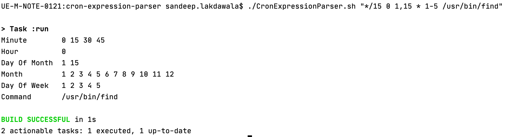

# README #
---------------------------------------------------------------------------------------------------
Cron Expression Parser
---------------------------------------------------------------------------------------------------
### - Tech Stack [Prerequisite for Local Run] ###

* Java 11 - [Language of Choice]
* Gradle - [Build Tool. Although same piece of code can be used without gradle as well. This is used just because it simplifies the development and maintenance of Projects]

---------------------------------------------------------------------------------------------------
### Assumption ###

* Special Characters allowed: * , - , ',', /

---------------------------------------------------------------------------------------------------
### Local Setup ###

* Clone/Check out the project and run Gradle build command.
* $./gradlew clean build
* Above command will also execute test cases and the build will fail if unit tests are not failing. 

Initial run might take time for build process. 
Subsequent runs should be faster.

---------------------------------------------------------------------------------------------------
### Run Command ###

* Make sure you are in the parent directory of the project
* Run script - CronExpressionParser.sh
* Sample usage : $./CronExpressionParser.sh "*/15 0 1,15 * 1-5 /usr/bin/find"

---------------------------------------------------------------------------------------------------
### Source Code

https://github.com/SandeepGitHub3/Cron-Expression-Parser/tree/main/src/main/java/com/deliveroo/cron_expression_parser

---------------------------------------------------------------------------------------------------

